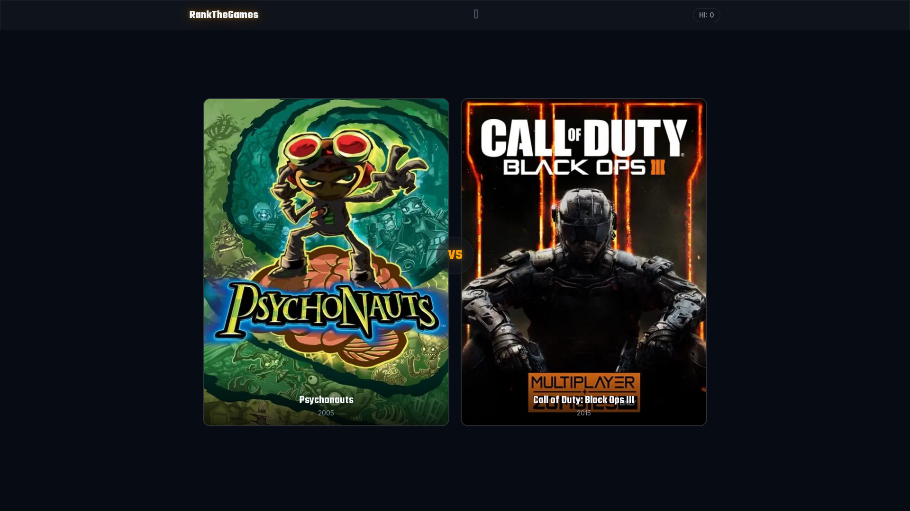

# ThisOrThatGame

A Higher-Lower style web game where players guess which video game is more popular.



## Tech Stack

- Next.js 15
- TypeScript
- Tailwind CSS v4
- MongoDB

## Getting Started

```bash
npm install
cp .env.example .env
npm run dev
```

Open [http://localhost:3000](http://localhost:3000) in your browser.

## Environment Variables

Copy `.env.example` to `.env` and fill in the following:

| Variable | Description |
|----------|-------------|
| `MONGODB_URI` | MongoDB connection string |
| `MONGODB_DB_NAME` | Database name |
| `RUN_TOKEN_SECRET` | Secret for signing run tokens |
| `IP_HASH_SALT` | Salt for hashing player IPs |
| `TWITCH_CLIENT_ID` | Twitch app client ID (used for IGDB auth) |
| `TWITCH_CLIENT_SECRET` | Twitch app client secret |
| `IGDB_CLIENT_ID` | IGDB API client ID |
| `IGDB_CLIENT_SECRET` | IGDB API client secret |

IGDB/Twitch credentials are only needed for seeding game data and cover images. The app itself only requires MongoDB and the token/hash secrets.

## Commands

| Command | Description |
|---------|-------------|
| `npm run dev` | Start development server |
| `npm run build` | Build for production |
| `npm run lint` | Run static analysis |
| `npm run test` | Run the test suite |